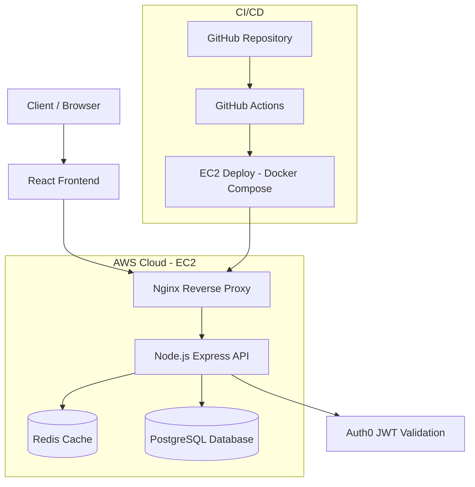

## Community Assistance Platform


A cloud-native, containerized full-stack platform that connects community volunteers with individuals requesting assistance.
It supports request management and appointment scheduling with a scalable backend foundation (PostgreSQL + Redis).

### Architecture

This project is a **containerized modular monolith** deployed with Docker Compose on AWS EC2.



Docker Compose services:

- **`web`**: Nginx serving the React build + reverse-proxying `/api/*` to the Node API
- **`api`**: Node.js + Express + Prisma API
- **`postgres`**: PostgreSQL database
- **`redis`**: Redis cache layer for hot reads

### Tech stack

- **Frontend**: React (CRA), Auth0
- **Backend**: Node.js, Express.js, Prisma ORM, PostgreSQL, Redis
- **Infra**: Docker, Docker Compose, Nginx
- **Automation**: GitHub Actions (CI + deploy)
- **Cloud**: Cloud-ready architecture with AWS EC2 deployment

### Key features

- **User management**: Auth0-protected routes + user verification/registration in Postgres
- **Request management**: create/update/delete + lifecycle \(OPEN → IN_PROGRESS → COMPLETED\)
- **Appointment scheduling**: one active appointment per request; request status updates on appointment actions
- **Redis caching**: caches high-frequency read endpoints with TTL + invalidation on writes
- **Health + metrics**: `/health` and `/metrics/cache` on the API

### API overview

- **Health**
  - `GET /health`
  - `GET /metrics/cache`
- **Auth**
  - `POST /verify-user`
- **User**
  - `GET /user`
  - `PUT /user`
- **Requests**
  - `POST /requests`
  - `GET /requests` *(cached)*
  - `GET /requests/user`
  - `GET /requests/:id` *(cached)*
  - `PUT /requests/:id`
  - `DELETE /requests/:id`
- **Appointments**
  - `POST /appointments`
  - `GET /appointments`
  - `GET /appointments/user`
  - `GET /appointments/:id`
  - `PUT /appointments/:id`
  - `DELETE /appointments/:id`

### Redis caching strategy

The API caches:

- `GET /requests` → key `requests:all:v1` \(TTL: 60s\)
- `GET /requests/:id` → key `requests:<id>:v1` \(TTL: 60s\)

Writes invalidate cache keys (requests + appointment actions that affect request status).
Responses include **`X-Cache: HIT|MISS`** and `/metrics/cache` exposes hits/misses/invalidations + hit rate.

### Verified locally

All of the following have been verified working end-to-end:

- `GET /requests` → `X-Cache: MISS` on first request, `X-Cache: HIT` on second
- `POST /requests` → invalidates cache → next `GET /requests` returns `X-Cache: MISS`
- `GET /health` → `{ ok: true, redis: { ok: true }, db: { ok: true } }`
- `GET /metrics/cache` → hits/misses/invalidations/hitRate
- Auth0 login → JWT verified by API → `GET /user` returns 200

### Run locally (Docker)

Prerequisites:

- Docker Desktop (Docker daemon must be running)

Setup:

```bash
cp .env.example .env
# Fill in Auth0 values in .env to use protected endpoints
docker compose up --build
```

Open:

- **Frontend**: `http://localhost:3000`
- **API (direct)**: `http://localhost:8080`
- **API health**: `http://localhost:8080/health`
- **Cache metrics**: `http://localhost:8080/metrics/cache`

### AWS deployment

See `infra/aws-ec2.md` for an EC2 + Docker Compose deployment path and HTTPS options (recommended: **ACM + ALB**).

### CI/CD

GitHub Actions workflows:

- **CI**: `.github/workflows/ci.yml` — runs on every push/PR to `master`
  - Client tests
  - API syntax check
  - Docker image builds for both `api` and `web`
- **Deploy**: `.github/workflows/deploy.yml` — triggered on push to `master`
  - SSH to EC2, pull latest code, write `.env` from GitHub Secrets, restart containers
  - Requires secrets: `EC2_HOST`, `EC2_USER`, `EC2_SSH_KEY`, `EC2_DEPLOY_PATH`, `EC2_ENV_FILE`

### Project structure

- `api/`: Express + Prisma API
- `client/`: React app
- `infra/`: Nginx config + prod compose + AWS deployment docs
- `.github/workflows/`: CI/CD workflows
